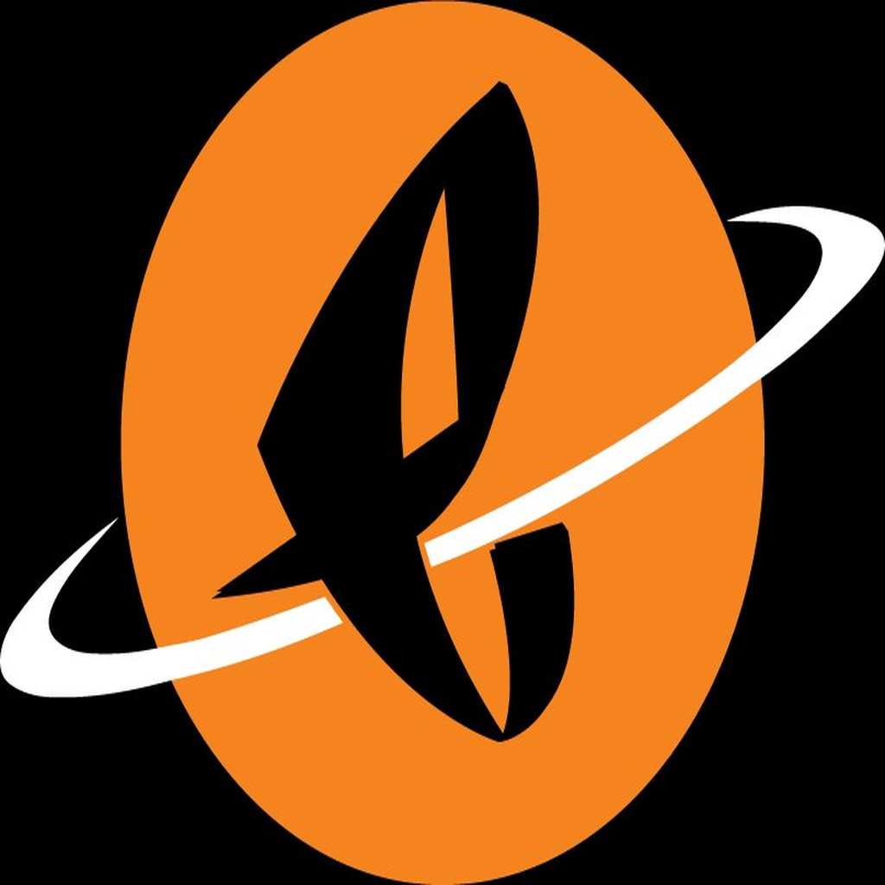

# FELLITO — AI Epic Go-Live Consultant

**Powered by Eclat Universe**

FELLITO is a digital clone of Fellito R. Rodriguez — 13+ year Epic Credentialed Trainer, 250+ physicians trained, 300+ nurses, 20+ major health systems. Available 24/7 on your phone, sharp as Day 1.

> Built for Epic ATE consultants. Not a chatbot. A colleague who's been on the floor.

---

## What FELLITO Does

- **19 dedicated Epic module agents** — CPOE, MyChart, Willow (Pharmacy), Beaker (Lab), ASAP (ED), Stork (OB), Radiant, Beacon (Oncology), OpTime, ADT, Prelude, Cadence, Resolute (Rev Cycle), ClinDoc, In Basket, Haiku/Canto, HIM, Healthy Planet, Reporting
- **Real-time RAG brain** — upload tip sheets, build docs, and orientation materials; FELLITO pulls the right context on the fly
- **Relationship memory** — remembers your last Go-Live, what the unit was struggling with, and greets you like a colleague, not a stranger
- **Voice input** — talk to FELLITO hands-free on the floor
- **Camera with PHI detection** — take pictures of workflows; Claude Vision blocks anything with patient data before it's processed
- **PWA** — installs on Android and iOS from Chrome, no app store needed
- **Streaming responses** — answers come in real time, no waiting

---

## Stack

- **Backend**: Node.js + Express.js (port 3001)
- **AI**: Claude Sonnet 4.6 — white-labeled as Eclat Universe (never exposed as Claude in UI)
- **Voice**: Web Speech API (mic input) + ElevenLabs voice clone
- **RAG**: TF-IDF cosine similarity, in-memory + disk JSON vector store
- **Auth**: JWT (30-day for named users, device-locked temp links for guests)
- **Memory**: Per-user Go-Live session journals, relationship context, struggle tracking
- **PHI Gate**: Claude Vision scans camera uploads; system prompt hard-blocks PHI in chat
- **Email**: nodemailer + Gmail SMTP for team invites
- **Tunnel**: Serveo.net SSH tunnel with auto-restart watchdog

---

## Module Agents

| Agent | Epic Module |
|-------|------------|
| ClinDoc | Clinical Documentation |
| CPOE | Order Entry |
| ASAP | Emergency Department |
| Beacon | Oncology |
| Beaker | Lab / LIS |
| ADT | Admissions / Discharge / Transfers |
| OpTime | Surgical / Periop |
| Prelude | Patient Registration |
| Cadence | Scheduling / Ambulatory |
| Radiant | Radiology |
| MyChart | Patient Portal |
| Willow | Pharmacy / BCMA |
| Stork | OB / Labor & Delivery |
| Resolute | Revenue Cycle / Billing |
| In Basket | Messaging / Routing |
| Haiku/Canto | Mobile Apps |
| Reporting | Analytics / SlicerDicer |
| HIM | Health Information Management |
| Healthy Planet | Population Health |

---

## PHI Guardrail

FELLITO **never touches patient data.**

- Camera uploads are scanned by Claude Vision before processing — PHI blocks the upload entirely
- System prompt hard rule: FELLITO refuses to engage with any patient information regardless of how it's phrased
- App handles only: workflow documentation, tip sheets, build docs, orientation materials

FELLITO never sees: patient names, MRNs, DOBs, SSNs, clinical records, or any PHI in any form.

---

## Setup

```bash
# 1. Clone and install
git clone https://github.com/cryptofedge/fellito-epic-ate-agent.git
cd fellito-epic-ate-agent/backend
npm install

# 2. Configure environment
cp .env.example .env
# Fill in: ANTHROPIC_API_KEY, ELEVENLABS_API_KEY, GMAIL_USER, GMAIL_APP_PASSWORD,
#          OWNER_EMAIL, OWNER_PASSWORD, JWT_SECRET, BASE_URL

# 3. Start (server + tunnel)
cd ..
bash start.sh
```

---

## Access

- **App (permanent):** `/app` — email + password, 30-day session
- **App (guest):** `/temp/:token` — device-locked, auto-expires
- **Admin portal:** `/admin` — owner only

---

## Data Boundary

| FELLITO handles | FELLITO never sees |
|---|---|
| Workflow documentation | Patient names / MRNs |
| Go-Live orientation materials | Clinical records or charts |
| Tip sheets and build docs | Any PHI in any form |
| Consultant questions about Epic workflows | SSNs, DOBs, insurance IDs |

---

*Built by Fellito R. Rodriguez · Eclat Universe · 2026*

---

## License & Brand



**FEDGE 2.O | Powered by Rafael Fellito Rodriguez and Eclat Universe**

© 2026 FEDGE 2.O. All rights reserved.

This project is part of the FEDGE 2.O ecosystem and is protected under full intellectual property rights reserved by Rafael Fellito Rodriguez and Eclat Universe.

- **Type:** Proprietary — All Rights Reserved
- **Owner:** Rafael Fellito Rodriguez and Eclat Universe
- **Brand:** FEDGE 2.O
- **Status:** Protected and Confidential

For licensing, partnerships, or usage permissions: **cryptofedge@gmail.com**
